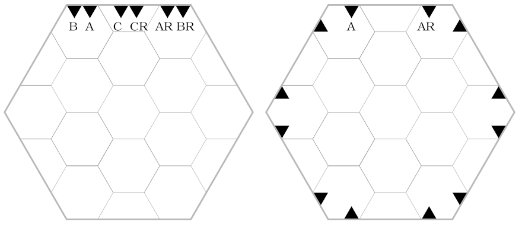

# Hextiles

Hex grid geomorph dungeon tiles for roleplaying games.

## Introduction

Geomorphs are map segments that can be arranged in multiple ways to create a larger, coherent map.

These hex-based geomorphs are based on hexes and half-hexes with a 25mm hex size (from centre to centre).

### Base tiles

The [base tiles](base-tiles) are 4 hexes in size (100mm from centre to centre), consisting of 13 full hexes and 6 half-hexes. This is enough for a 3x3 room, a short segment of corridor, or a segement of a larger room.

A half-hex base tile is 2 hexes high and consists of 5 full hexes and 6 half-hexes.

### Tile groups

The base geomorphs can then be grouped into larger [tile groups](tile-groups), such as a long corridor, a large room, or a layout with a cluster of small rooms/corridors.

Tile groups up to 2 base tiles high and three base tiles wide fit nicely on a printed A4 landscape page at 200mm high and 289mm wide.

This configuration consists of 5 full base tiles and 2 half-tiles. It is 8 hexes high and 12 hexes on the diagonal.

You can easily join two large tile groups together along the flat side, or combine them with other tile groups or individual base tiles.

Including the half-tiles in the system allows for efficient placement of corridors running across the hexes (a lot of construction uses right angles).

## Tools

[Inkscape](https://inkscape.org/) is used to create and manage the vector-based tiles.

## Instructions

### Creating a base tile

* Use `hex-master-1.svg` to turn on or off the relevant elements (walls, etc) that make up the tile.
* When you have what you want, make sure no layers are locked (so they can be selected), and select all the elements on the page.
* Use the export tool to export the Document (not Page), making sure that Export Selected only is ticked.
* This will trim items that are not display (not selected) from the export, keeping it simple.

Corridor connections between base tiles use the centre hex of each face, for consistent connection points.

#### Naming conventions

Names are suffixed with the available connection types for each edge of the tile.

Each edge of the tile consists of the sides of two corner hexes, plus a half-hex in the middle. There are 3 connection points:

* A: The vertex between the corner hexes and the half-hex. This is the connection point for single width corridors (AA), and also for the left (A) and right (AR) sides of a multi-tile open area. A horizonal single width corridor fits in a half-tile.
* B: The half way point of the corner hexes, used for double-width corridors, either vertical or horizonal (fitting in a half-tile).
* C: The middle of the edge, alternative used for a double-width horizontal coridor across two edges: the left side (C) on one and the next edge as the right side (CR). Alternating half-tiles for double-width horizontal corridors use two tiles each with a single wall using the C/CR points.
* D: Quarter point of the middle edge, the middle between A & C; not currently used.

Each edge either has two connection points for a corridor, e.g. AA or BB, or has connection points on separate edges for an open area or the alternate horizonal corridor, e.g. A+AR, C+CR.

Tiles have a suffix indicating the connection types, along with O for open edges and X for closed (non-connecting) edges, with a number to indicate if there are multiple edges of the same type in a row.

Naming rules:
* Describe the relevant features.
* Unspecified edges are not connected, so when naming drop the largest X group and start with the edge after it.
* If there are two X groups with the same size, use the start that is lowest alphabetically.
* Additional features of the connections can be listed after the connections, indexed by numerical order (if all other conditions are equal, use the lowest numbers).

For half-tiles:
* Half-tiles start with the prefix 'half-'
* Specific the three hex edges clockwise, ignoring the normal rules. 

Examples:
* 'vertical-AA-X2-AA' has an AA connection, two unconnected edges, then another AA connection on the opposite side; the last two sides are closed, i.e. a straight corridor.
* 'corner-left-AA-X-AA' is an L-shaped corner (use 'angle' to indicate other angles), so one of the corridors is horizontal (i.e. could fit in a half-tile). As the connections are separated by one edge this is the second horizontal (approaching along the vertical), and there are left and right versions.
  * NOT 'corner-left-AA-X3-AA', as we drop the largest X group. This means the first AA is actually the horizontal, even though we describe left/right from the point of view of the vertical corridor.
* 'half-corner-left-AA2' is a similar corner, but at the first (adjacent) horizontal, so only needs a half-tile.
* 'area-A-O-AR-X-AA' has a left side wall on the first face, and open side, a right side wall, and then a single width corridor opposite. There are two closed sides, but drop the one before the open area because 'A' comes before 'AA'.
  * NOT 'area-AA-X-A-O-AR', as we start after the (same size) X that is first alphabetically ('A-' is before 'AA').
* 'vertical-AA-X2-AA-door-1' is the straight corridor with two AA connections, with the first of them having a door.
  * NOT 'vertical-AA-X2-AA-door-4', as we use the lowest number
* 'area-A-O-AR-X-AA-door-5' would indicate a door on the single width exit (edge number 5).
* 'half-corner-right-X-AA2' indicates an L-shaped half-tile with two single width exits at the top and right sides, and nothing on the left.
  * NOT 'half-corner-right-AA2', as we start half-tiles from the first clockwise edge.

When combining tiles the connections should match, i.e. AA matches to AA, and BB matches to BB; for the single wall the opposite sides need to match, i.e. A matches to AR, and C matches to CR.

This at a glance allows you to see which tiles can potentially match with others.

In addition some smaller connections will block the rest of the edge, allowing them to be joined to larger connections if needed.

### Combining base tiles

To combine base tiles into a tile group that fits on an A4 page, create a new document in Inkscape, import the needed tiles, rotate if needed, and place at the following locations.

Note that these use geometric bounding boxes, excluding border width (the Inkscape default is usually visual bounding boxes). To change this in Inkscape use Edit > Preferences, and then change under Tools > Bounding box to use.

* Tile 0101: x=5, y=5
* Tile 0102: x=5, y=105 
* Half 0201: x=91.603, y=5
* Tile 0202: x=91.603, y=55 
* Half 0203: x=91.603, y=155
* Tile 0301: x=178.205, y=5
* Tile 0302: x=178.205, y=105 

This gives a 5mm margin around the tile group.

To create a PDF you can use Print to PDF (on Windows), or you can export the Page.

## Folders

* master : Master Inkscape for for creating base tiles (and half-tiles), with layers and groups for different wall segments.
* base-tiles : Exported base tiles in various configurations. Tiles may be rotated as needed, or reversed (if printing on paper you need to print the reversed tiles as well)
* tile-groups : Larger groups of tiles, up to A4 in size. Combine this with individual base tiles as needed.

## 15mm hex grid

There is also a 15mm hex grid, suitable for overland mapping.

This allows 3 tiles high by 5 tiles wide to fit on an A4 page (with half-tiles along the top and bottom).

Scale up by factors of 4 if you want to be consistent with the base tiles.

e.g. If hexes are 5 feet each, then a base tiles are 20 feet (from centre to centre).

There is a sample map in `15mm\sample` that uses 80 feet hexes (i.e. 4x base tile) and 320 feet larger groupings.

This map is around 1,000 x 1,500 feet, suitable for a town or village and surrounds.

## Copyright

Hextiles © 2024 by Sly Gryphon is licensed under Creative Commons Attribution-ShareAlike 4.0 International. To view a copy of this license, visit <https://creativecommons.org/licenses/by-sa/4.0/>
